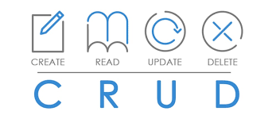
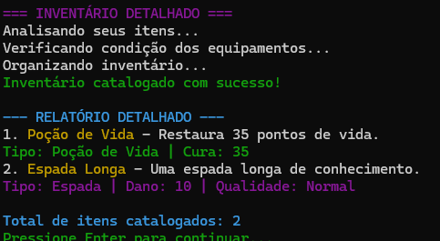

<div align="center">

# ⚔️ RPG Batalha por Turnos - Operação: Código Amaldiçoado ⚔️

**Um simulador de batalha de RPG em console, construído com Java puro para demonstrar conceitos avançados de Programação Orientada a Objetos e design de software.**

</div>

<div align="center">


</div>

</div>

<br>

<div align="center">


</div>

---

> Este projeto é um showcase técnico e um trabalho de fã inspirado no universo de **Ordem Paranormal RPG**. Ele foi criado com o objetivo de aplicar e solidificar conhecimentos em desenvolvimento de software, desde os fundamentos de POO até a persistência de dados com um banco de dados local.

<br>

## 📜 Índice

- [⚔️ RPG Batalha por Turnos - Operação: Código Amaldiçoado ⚔️](#️-rpg-batalha-por-turnos---operação-código-amaldiçoado-️)
  - [📜 Índice](#-índice)
  - [✨ Funcionalidades Principais](#-funcionalidades-principais)
  - [🛠️ Tecnologias e Conceitos Aplicados](#️-tecnologias-e-conceitos-aplicados)
    - [O que é CRUD?](#o-que-é-crud)
    - [Implementação no Projeto](#implementação-no-projeto)
      - [CREATE: Salvando um Novo Herói](#create-salvando-um-novo-herói)
      - [READ: Carregando Heróis Salvos](#read-carregando-heróis-salvos)
      - [UPDATE: Atualizando o Progresso do Herói](#update-atualizando-o-progresso-do-herói)
      - [DELETE: Excluindo um Herói](#delete-excluindo-um-herói)
  - [📚 Quer se Aprofundar? Acesse a Wiki!](https://github.com/gui-ccr/rpg-batalha-console-java/wiki)
  - [🚀 Comece a Jogar em 5 Minutos](#-comece-a-jogar-em-5-minutos)
    - [**📋 Pré-requisitos**](#-pré-requisitos)
    - [**▶️ Executando o Jogo**](#️-executando-o-jogo)
  - [📸 Galeria do Jogo](#-galeria-do-jogo)
  - [📂 Estrutura do Projeto](#-estrutura-do-projeto)
  - [📈 Roadmap de Desenvolvimento](#-roadmap-de-desenvolvimento)
  - [⚠️ Aviso Legal e Créditos](#️-aviso-legal-e-créditos)
  - [📄 Licença](#-licença)

---

## ✨ Funcionalidades Principais

Este projeto vai além de uma simples batalha. É um sistema de RPG completo com mecânicas pensadas para criar uma experiência de jogo dinâmica e re-jogável.

| Funcionalidade          | Descrição                                                                                             | Status      |
| ----------------------- | ----------------------------------------------------------------------------------------------------- | ----------- |
| ⚔️ **Combate por Turnos** | Sistema de batalha com ataques normais, habilidades especiais, chance de crítico e esquiva.             | ✅ Concluído |
| 💾 **Persistência de Dados** | Salve e carregue seus heróis! Todo o progresso é armazenado em um banco de dados **SQLite** local.      | ✅ Concluído |
| 📈 **Progressão de Herói** | Ganhe experiência, suba de nível, e veja seus atributos e status de combate melhorarem automaticamente. | ✅ Concluído |
| 🎒 **Sistema de Inventário** | Colete, equipe espadas para aumentar seu dano e use poções para se curar no meio do combate.         | ✅ Concluído |
| 🎨 **UI de Console Rica** | Interface colorida e com feedback claro para todas as ações, melhorando a experiência do jogador.   | ✅ Concluído |
| 🎲 **Nomes Aleatórios** | Heróis e monstros recebem nomes dinâmicos a cada partida, garantindo variedade.                     | ✅ Concluído |

---

## 🛠️ Tecnologias e Conceitos Aplicados

Este projeto foi uma excelente oportunidade para aplicar um vasto conjunto de conhecimentos teóricos em um cenário prático e funcional.

<details>
<summary><strong>🧠 Conceitos de Programação Orientada a Objetos (POO)</strong></summary>

* **Classes e Objetos:** Modelagem de todas as entidades (`Heroi`, `Monstro`, `Item`).
* **Encapsulamento:** Uso de `private` com Getters e Setters para proteger o estado dos objetos.
* **Herança:** `Heroi` e `Monstro` herdam de uma classe abstrata `Personagem`.
* **Polimorfismo:** Sobrescrita de métodos como `atacar()` para comportamentos específicos.
* **Classes Abstratas:** `Personagem` e `Item` como contratos base.
* **Interfaces:** Uso de `Equipavel` para definir um contrato que itens vestíveis devem seguir.
* **Composição:** O `Heroi` *tem um* `Inventario`, que por sua vez *tem uma lista* de `Item`.

</details>


<details>
<summary><strong>💾 Camada de Persistência e Padrão CRUD </strong></summary>


<br>

A capacidade de salvar e carregar o progresso é crucial para a experiência do jogador. Este projeto implementa uma camada de persistência de dados utilizando um banco de dados **SQLite**, orquestrada através do padrão de arquitetura **CRUD**.

### O que é CRUD?

CRUD é um acrônimo para as quatro operações essenciais que uma aplicação realiza sobre dados persistentes. É a base para a maioria das aplicações que interagem com bancos de dados.

* **CREATE (Criar):** Adicionar novos registros no banco de dados.
* **READ (Ler):** Consultar dados que já existem no banco.
* **UPDATE (Atualizar):** Modificar um registro existente.
* **DELETE (Deletar):** Remover permanentemente um registro.

### Implementação no Projeto

A classe `RepositorioDeHerois` é a responsável por traduzir as necessidades do jogo em comandos para o banco de dados, aplicando concretamente cada uma das operações CRUD.

#### CREATE: Salvando um Novo Herói
Quando o jogador cria um novo personagem, o método `salvar()` é invocado para inserir os dados do novo herói na tabela.

```java
// Em: src/main/java/com/guiccr/rpg/repository/RepositorioDeHerois.java
public static void salvarHeroi(Heroi heroi) {
        garantirColunaVidaAtual(); // Garantir que a coluna existe antes de salvar
        garantirTabelaInventario(); // Garantir que a tabela de inventário existe
        String sql = "INSERT OR REPLACE INTO herois (nome, vida_atual, vida_maxima, ataque, defesa, chance_critico, multiplicador_critico, chance_esquiva, energia, forca, agilidade, vigor, presenca, intelecto, nivel, experiencia_atual, experiencia_para_proximo_nivel) VALUES (?, ?, ?, ?, ?, ?, ?, ?, ?, ?, ?, ?, ?, ?, ?, ?, ?)";
        try (Connection conexao = DriverManager.getConnection(URL_JDBC);
             PreparedStatement preparedStatement = conexao.prepareStatement(sql)) {
            preparedStatement.setString(1, heroi.getNome());
                 // outros sets....
             } catch (SQLException e) {
            System.err.println("Erro ao salvar o herói no banco de dados: " + e.getMessage());
        }
```

#### READ: Carregando Heróis Salvos
Para que o jogador possa continuar uma aventura, o método `buscarTodos()` consulta e retorna uma lista com todos os heróis salvos.

```java
// Em: src/main/java/com/guiccr/rpg/repository/RepositorioDeHerois.java
public static Optional<Heroi> buscarHeroi(String nome) {
        garantirColunaVidaAtual(); // Garantir que a coluna existe antes de buscar
        String sql = "SELECT * FROM herois WHERE nome = ?;";
        try (Connection conexao = DriverManager.getConnection(URL_JDBC);
             PreparedStatement preparedStatement = conexao.prepareStatement(sql)) {
            preparedStatement.setString(1, nome);
            try (ResultSet resultado = preparedStatement.executeQuery()) {
                if (resultado.next()) {
                    Heroi heroiEncontrado = new Heroi(
                        resultado.getInt("id"),
                    resultado.getString("nome"),
                 // outros getters.....
                 return Optional.of(heroiEncontrado));
                }
            }
            return Optional.empty();
        } catch (SQLException e) {
            System.err.println("Erro ao buscar herói no banco de dados: " + e.getMessage());
            e.printStackTrace();
            return Optional.empty();
        }
    }
```

#### UPDATE: Atualizando o Progresso do Herói
Após uma batalha ou ao subir de nível, o método `atualizar()` é chamado para persistir as novas informações (nível, experiência, vida, etc.) do herói no banco.

```java
// Em: src/main/java/com/guiccr/rpg/repository/RepositorioDeHerois.java
public static void atualizarHeroi(Heroi heroi) {
        garantirColunaVidaAtual(); // Garantir que a coluna existe antes de atualizar
        String sql = "UPDATE herois SET " +
                     "nome = ?, vida_atual = ?, vida_maxima = ?, ataque = ?, defesa = ?, chance_critico = ?, " +
                     "multiplicador_critico = ?, chance_esquiva = ?, energia = ?, forca = ?, " +
                     "agilidade = ?, vigor = ?, presenca = ?, intelecto = ?, nivel = ?, " +
                     "experiencia_atual = ?, experiencia_para_proximo_nivel = ? " +
                     "WHERE nome = ?;";
        try (Connection conexao = DriverManager.getConnection(URL_JDBC);
             PreparedStatement preparedStatement = conexao.prepareStatement(sql)) {
            preparedStatement.setString(1, heroi.getNome());
             // outros getters....
             }} catch (SQLException e) {
            System.err.println("Erro ao atualizar o herói no banco de dados: " + e.getMessage());
        }
    }
             
```

#### DELETE: Excluindo um Herói
Quando o jogador escolhe excluir um personagem, o método `excluir()` executa o comando `DELETE` para remover o registro do herói do banco de dados.

```java
// Em: src/main/java/com/guiccr/rpg/repository/RepositorioDeHerois.java
public static void deletarHeroi(String nome) {
        String sql = "DELETE FROM herois WHERE nome = ?;";
        try (Connection conexao = DriverManager.getConnection(URL_JDBC);
             PreparedStatement preparedStatement = conexao.prepareStatement(sql)) {
            preparedStatement.setString(1, nome);
            int linhasAfetadas = preparedStatement.executeUpdate();
            if (linhasAfetadas > 0) System.out.println("Herói " + nome + " deletado com sucesso!");
            else System.out.println("Nenhum herói encontrado com o nome " + nome + " para ser deletado.");
        } catch (SQLException e) {
            System.err.println("Erro ao deletar o herói do banco de dados: " + e.getMessage());
        }
    }
```

</details>


<details>
<summary><strong>💻 Stack de Desenvolvimento e Ferramentas</strong></summary>

* **Linguagem:** `Java 17+`
* **Banco de Dados:** `SQLite` para persistência de dados local e sem necessidade de servidor.
* **Conectividade DB:** `JDBC` (Java Database Connectivity) para comunicação com o SQLite.
* **Controle de Versão:** `Git` e `GitHub`.
* **Build/Execução:** Scripts (`.bat`) para facilitar a compilação e execução.

</details>

<details>
<summary><strong>🏛️ Arquitetura e Boas Práticas</strong></summary>

* **Repository Pattern:** A classe `RepositorioDeHerois` isola toda a lógica de acesso a dados, separando as regras de negócio da persistência.
* **Tratamento de Exceções:** Uso de `try-catch` para lidar com erros de SQL e entrada de usuário.
* **Código Limpo:** Foco em nomes de variáveis e métodos claros e uma estrutura de pacotes organizada.

</details>

---

## 🚀 Comece a Jogar em 5 Minutos

Siga os passos abaixo para mergulhar na aventura.

### **📋 Pré-requisitos**
1.  **Java Development Kit (JDK) 17 ou superior:** [Faça o download aqui](https://www.oracle.com/java/technologies/downloads/).
    * *Verificação:* Abra seu terminal e digite `java --version`.
2.  **Git (Opcional):** [Faça o download aqui](https://git-scm.com/downloads).

### **▶️ Executando o Jogo**

<details>
<summary><strong>Opção 1: Para Jogadores (Recomendado)</strong></summary>

1.  Vá para a **[Página de Releases](https://github.com/gui-ccr/rpg-batalha-console-java/releases)** do projeto.
2.  Baixe o arquivo `.jar` da versão mais recente (ex: `rpg-batalha-console-java-1.0.0-jar-with-dependencies.jar`).
3.  Abra um terminal na pasta onde você baixou o arquivo e execute:
    ```bash
    java -jar nome-do-arquivo.jar
    ```
4.  Divirta-se! 🎮

</details>

<details>
<summary><strong>Opção 2: Para Desenvolvedores (Multiplataforma)</strong></summary>

1.  **Clone o repositório:**
    ```bash
    git clone [https://github.com/gui-ccr/rpg-batalha-console-java.git](https://github.com/gui-ccr/rpg-batalha-console-java.git)
    cd rpg-batalha-console-java
    ```
2.  **Compile o código:**
    ```bash
    # Para Linux/Mac
    javac -d target/classes -cp "lib/*" src/main/java/com/guiccr/rpg/*.java

    # Para Windows (PowerShell)
    javac -d target/classes -cp "lib\*" src\main\java\com\guiccr\rpg\*.java
    ```
3.  **Execute o jogo:**
    ```bash
    # Para Linux/Mac
    java -cp "target/classes:lib/*" com.guiccr.rpg.Main

    # Para Windows (PowerShell)
    java -cp "target\classes;lib\*" com.guiccr.rpg.Main
    ```

</details>

---

## 📸 Galeria do Jogo

<div align="center">
    
    
</div>

---

## 📂 Estrutura do Projeto

A estrutura de pastas foi organizada para separar responsabilidades, seguindo as convenções do Maven.

```
rpg-batalha-console-java/
├── assets/           # Imagens e GIFs para o README
├── db/               # Scripts e banco de dados
├── lib/              # Dependências .jar (JDBC Driver)
├── src/
│   └── main/java/com/guiccr/rpg/
│       ├── Main.java                # Ponto de entrada
│       ├── ConsoleColors.java       # Arquivo de Enums de cores do terminal
│       ├── GeradorDeNomes.java      # Gerador de nomes
│       ├── MenuPrincipal.java       # Menu Principal
│       ├── model/                   # Pacote para entidades (Heroi, Monstro)
│       ├── repository/              # Pacote para acesso a dados
│       └── service/                 # Pacote para regras de negócio (Batalha)
├── .gitignore
├── Jogar.bat         # Script de execução para Windows
├── LICENSE
└── README.md
```

---
## 📚 Quer se Aprofundar? Acesse a Wiki!

Este `README` oferece uma visão geral do projeto. Para um mergulho profundo na **arquitetura**, nas **mecânicas de jogo**, no **diagrama de classes UML** e em outras documentações técnicas, a **Wiki** do projeto é o seu destino!

<div align="center">

<h3><a href="https://github.com/gui-ccr/rpg-batalha-console-java/wiki">➡️ Acessar a Wiki do Projeto</a></h3>

</div>

---
## 📈 Roadmap de Desenvolvimento

O projeto segue um plano de desenvolvimento claro, com futuras expansões já idealizadas.

-   [x] **Fase 0: Infraestrutura:** Estrutura de pastas, README e licença.
-   [x] **Fase 1: Mecânicas de Jogo:** Sistema de combate, nomes dinâmicos e UI.
-   [x] **Fase 2: Expansão POO:** Level up, inventário, itens e habilidades.
-   [x] **Fase 3: Persistência:** Implementação completa de Salvar/Carregar com SQLite.
-   [ ] **Fase 4: Refatoração e Qualidade:**
    -   [ ] Adicionar testes unitários (JUnit).
    -   [x] Refatorar para pacotes de `model`, `service` e `repository`.
    -   [ ] Implementar um sistema de Log (ex: Log4j).
- [x] **Fase 5: Empacotamento e Release v1.0.0**
-   [ ] **Fase 6: Futuras Funcionalidades:**
    -   [ ] Sistema de classes de Herói (Guerreiro, Mago).
    -   [ ] Múltiplos tipos de monstros.
    -   [ ] Masmorras com múltiplas batalhas.

---

## ⚠️ Aviso Legal e Créditos

Este projeto é um **trabalho de fã e de estudo**, **não oficial** e **não possui afiliação ou endosso** por Rafael Lange Severino "Cellbit" ou pela Ordem Paranormal RPG. Ele é uma homenagem e um exercício de programação inspirado na rica temática e conceitos do universo de Ordem Paranormal. Todos os direitos sobre a obra original pertencem aos seus respectivos criadores.

---

## 📄 Licença

Este projeto está sob a licença [MIT License](LICENSE).
